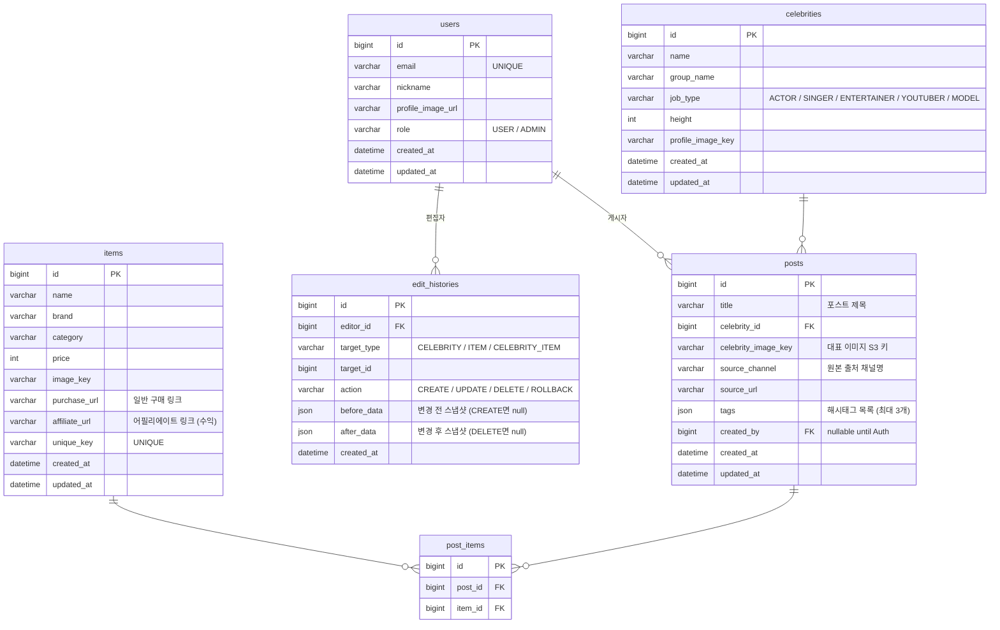

# ERD

## 1. 설계 방향

아라내는 **나무위키처럼 누구나 즉시 정보를 등록·수정**할 수 있는 서비스다.
관리자 승인 없이 팬이 직접 데이터를 반영하되, 잘못된 수정을 되돌릴 수 있도록 **편집 이력**을 남긴다.

### 핵심 원칙

- 로그인한 사용자라면 누구나 데이터를 직접 생성·수정·삭제할 수 있다.
- 모든 쓰기 작업은 `edit_histories`에 변경 전/후 스냅샷을 기록한다.
- 이력을 활용해 관리자 또는 서버가 이전 상태로 롤백할 수 있다.
- 비로그인 사용자는 조회만 가능하다.

---

## 2. 다이어그램



---

## 3. 테이블 상세

### users
| 컬럼 | 타입 | 제약 | 설명 |
|---|---|---|---|
| id | BIGINT | PK, AUTO_INCREMENT | |
| email | VARCHAR(255) | NOT NULL, UNIQUE | OAuth 이메일 |
| nickname | VARCHAR(100) | NOT NULL | 표시 이름 |
| profile_image_url | VARCHAR(500) | | 프로필 이미지 |
| role | VARCHAR(20) | NOT NULL | USER / ADMIN |
| created_at | DATETIME | NOT NULL | |
| updated_at | DATETIME | NOT NULL | |

### celebrities
| 컬럼 | 타입 | 제약 | 설명 |
|---|---|---|---|
| id | BIGINT | PK, AUTO_INCREMENT | |
| name | VARCHAR(100) | NOT NULL | 연예인 이름 |
| group_name | VARCHAR(100) | | 소속 그룹명 |
| job_type | VARCHAR(20) | | ACTOR / SINGER / ENTERTAINER / YOUTUBER / MODEL |
| height | INT | | 키 (cm) |
| profile_image_key | VARCHAR(500) | | S3 오브젝트 키 |
| created_at | DATETIME | NOT NULL | |
| updated_at | DATETIME | NOT NULL | |

### items
| 컬럼 | 타입 | 제약 | 설명 |
|---|---|---|---|
| id | BIGINT | PK, AUTO_INCREMENT | |
| name | VARCHAR(200) | NOT NULL | 상품명 |
| brand | VARCHAR(100) | | 브랜드 |
| category | VARCHAR(50) | | 카테고리 |
| price | INT | | 가격 (원) |
| image_key | VARCHAR(500) | | S3 오브젝트 키 |
| purchase_url | VARCHAR(1000) | | 일반 구매 링크 |
| affiliate_url | VARCHAR(1000) | | 어필리에이트 링크 (수익용) |
| unique_key | VARCHAR(400) | NOT NULL, UNIQUE | 중복 방지 키 |
| created_at | DATETIME | NOT NULL | |
| updated_at | DATETIME | NOT NULL | |

### posts
| 컬럼 | 타입 | 제약 | 설명 |
|---|---|---|---|
| id | BIGINT | PK, AUTO_INCREMENT | |
| title | VARCHAR(200) | NOT NULL | 포스트 제목 |
| celebrity_id | BIGINT | NOT NULL, FK | |
| celebrity_image_key | VARCHAR(500) | | 대표 이미지 S3 키 |
| source_channel | VARCHAR(100) | | 원본 출처 채널명 |
| source_url | VARCHAR(1000) | | 원본 출처 URL |
| tags | JSON | | 해시태그 목록 (최대 3개) |
| created_by | BIGINT | FK (nullable) | Auth 구현 전까지 nullable |
| created_at | DATETIME | NOT NULL | |
| updated_at | DATETIME | NOT NULL | |

### post_items
| 컬럼 | 타입 | 제약 | 설명 |
|---|---|---|---|
| id | BIGINT | PK, AUTO_INCREMENT | |
| post_id | BIGINT | NOT NULL, FK | |
| item_id | BIGINT | NOT NULL, FK | |

**UNIQUE**: `(post_id, item_id)`

### edit_histories
| 컬럼 | 타입 | 제약 | 설명 |
|---|---|---|---|
| id | BIGINT | PK, AUTO_INCREMENT | |
| editor_id | BIGINT | NOT NULL, FK | 편집한 사용자 |
| target_type | VARCHAR(50) | NOT NULL | CELEBRITY / ITEM / CELEBRITY_ITEM |
| target_id | BIGINT | NOT NULL | 변경된 레코드 PK |
| action | VARCHAR(20) | NOT NULL | CREATE / UPDATE / DELETE / ROLLBACK |
| before_data | JSON | | 변경 전 스냅샷 (CREATE면 null) |
| after_data | JSON | | 변경 후 스냅샷 (DELETE면 null) |
| created_at | DATETIME | NOT NULL | |

---

## 4. 유니크 제약 정리

| 테이블 | 유니크 대상 | 목적 |
|---|---|---|
| users | email | 계정 중복 방지 |
| items | unique_key | 동일 상품 중복 등록 방지 |
| post_items | (post_id, item_id) | 포스트 내 아이템 중복 방지 |

---

## 5. 중복 방지 전략

### 5.1 아이템 중복 방지: items.unique_key

- **생성 규칙**: `lower(brand) + "|" + normalize(name) + "|" + lower(category)`
- **normalize**: trim → 소문자 → 공백을 `-`로 치환
- **예시**: `nike|air-force-1-low-white|shoes`

### 5.2 착장 중복 방지: celebrity_items UNIQUE

같은 연예인이 같은 아이템을 **다른 콘텐츠·회차에서** 착용하는 것은 허용.
동일한 콘텐츠·회차에 같은 아이템이 중복 등록되는 것만 방지.

---

## 6. 수익 구조

| 방식 | 필드 | 설명 |
|---|---|---|
| 구글 애드센스 | — | 페이지 광고 배너 |
| 어필리에이트 | `items.affiliate_url` | 쿠팡파트너스, 네이버 쇼핑파트너 등 클릭당 수익 |

`affiliate_url`은 등록 시 선택 입력. 없으면 `purchase_url`로 대체 표시.

---

## 7. 편집 이력 및 롤백 워크플로우

```
사용자 → API 요청 → 실제 테이블 즉시 반영
                      ↓
             edit_histories에 기록 (before_data / after_data)
```

롤백: 관리자가 특정 이력의 `before_data`를 실제 테이블에 덮어씀 → 롤백 자체도 ROLLBACK 액션으로 기록.

---

## 8. 삭제된 설계

| 기존 | 제거 이유 |
|---|---|
| `edit_proposals` | 위키 방식으로 전환 |
| `approval_histories` | 승인 워크플로우 제거 |
| `celebrity_items (celebrity_id, item_id) UNIQUE` | 동일 아이템을 여러 콘텐츠에서 착용 허용 |
